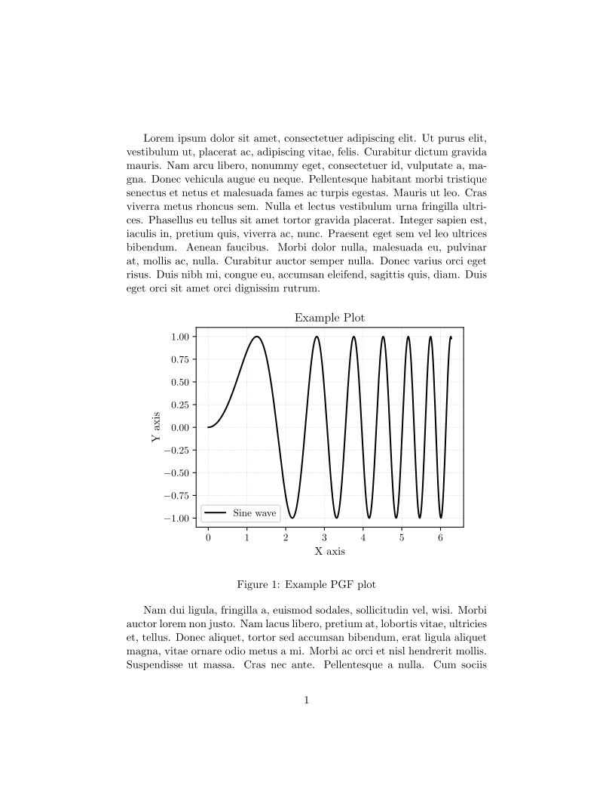
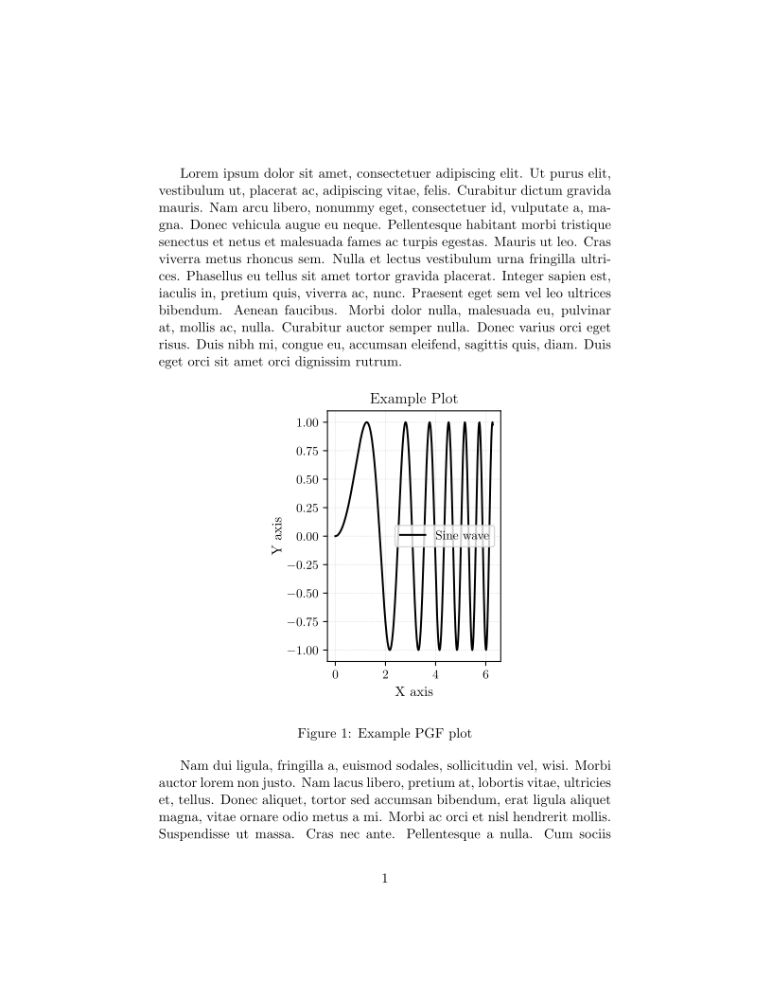
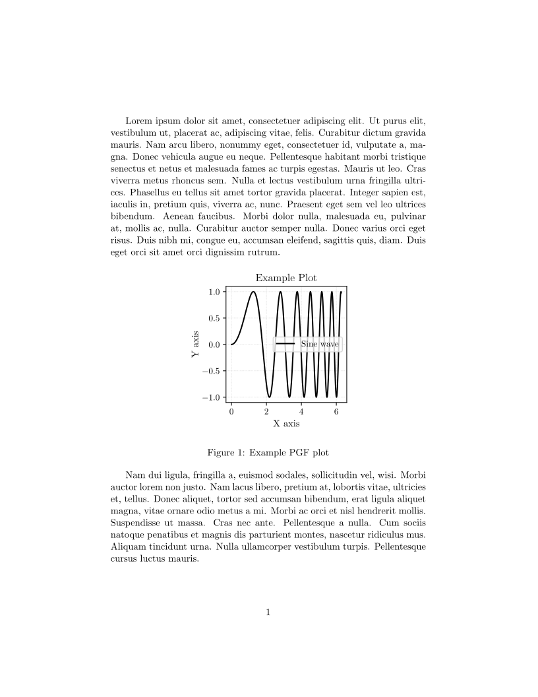

# Matplotlib → LaTeX (PGF) Export — figure_to_latex

**LaTeX-ready Matplotlib exports (PGF) with on-screen parity.**  
Export figures exactly at your LaTeX document’s `\textwidth` (no scaling in LaTeX), keeping the interactive view and the PGF output visually identical.

- Fonts, math, and symbols are rendered by LaTeX itself → visually identical to the rest of your document (no rasterized images).
- Exact sizing to a fraction of `\textwidth`
- No manual rescaling in LaTeX → what you see in plt.show() is exactly what you get in your PDF.
- LaTeX/PGF integration (`text.usetex`, preamble, fonts)
- Optional outer side margins (left/right) per project or per plot

## Install

This is a single file. Vendor it into your project and import it.

## Configuration

Before plotting, you must configure the figure export to match your LaTeX document.

Open `figure_to_latex.py` and set these at the top:

```python
# figure_to_latex.py  (top of file)

# 1) Your LaTeX \textwidth in TeX points
TEXTWIDTH_PT = 345.0

# 2) Your document font sizes and LaTeX engine
_DEFAULTS = {
    "engine": "pdflatex",        # or "lualatex", "xelatex"
    "base_font_pt": 11,        # body text size (pt)
    "axes_label_pt": None,       # None => uses base_font_pt
    "tick_font_pt": 10,          # tick label size (pt)
    "legend_font_pt": 10,        # legend text size (pt)
    "family": "serif",
    "serif": ["Computer Modern"], # match your LaTeX serif family
    "use_tex": True,
    "use_mathtext_for_ticks": False,
    "side_margin": None,         # e.g. 0.03 for 3% on both sides
    ...
}
```

- Get \textwidth (in pt) 
    Run in LaTeX:  
    ```latex
    \documentclass{article}
    \begin{document}
    \showthe\textwidth
    Hello world
    \end{document}
    ```

- Get your document’s base font size (pt)
    ```latex
    \makeatletter
    The base font size is \f@size pt.
    \makeatother
    ```

## Usage

```bash
import numpy as np
import matplotlib.pyplot as plt
from figure_to_latex import configure_latex, export_latex

# 1) Configure once
configure_latex()

# 2) Matplotlib plot

x = np.linspace(0, 2 * np.pi, 400)
y = np.sin(x ** 2)

fig, ax = plt.subplots()

ax.plot(x, y, label="Sine wave")
ax.set_xlabel("X axis label")
ax.set_ylabel("Y axis label")
ax.set_title("Example Plot")
ax.legend()
ax.grid(True, linestyle=":", linewidth=0.5, alpha=0.7)

# 3) Export exactly at \textwidth, preserving the current aspect
export_latex(
    fig,
    name="example",        # of with a path: "figures/example"
    fraction=1.0,          # 1.0 = full \textwidth
    # aspect=None -> infer from current figure; pass 0.62 to force
    formats=("pgf",),      # add "pdf","png" if you also want previews
    show=True,             # interactive preview identical to PGF
    # side_margin=0.0,     # per-plot override; None uses global default
    # font_size=12, axes_label_size=12, tick_size=10, legend_size=10,
    # debug=True,
)
```

## Example exports

`export_latex` settings used:

```python
# Auto height (aspect inferred, no side margins)
export_latex(fig, name="example1")

# Extra breathing room on both sides
export_latex(fig, name="example2", side_margin=0.3)

# Shorter figure by fixing the aspect ratio
export_latex(fig, name="example2", side_margin=0.3, aspect=0.5)
```

#### Auto height, no side margins



#### Side margin = 0.3



#### Side margin = 0.3 and Fixed aspect = 0.5



Recommended LaTeX include

Use PGF directly (no scaling in LaTeX):

```bash
\begin{figure}
  \input{figures/example.pgf}
\end{figure}
```